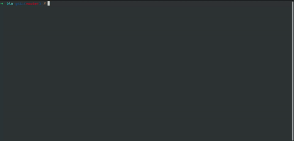

# Seldon
a simple cli tool to analyse directories written in kotlin and mosaic that leverages Jetpack Compose compiler/runtime using [Mosaic](https://github.com/JakeWharton/mosaic) to
render stuff on commandline

# Building and running
after successfully cloning and loading the project you can run the following gradle task
to build binaries.

```bash
./gradlew installDist
```

this will generate an executable at ``Seldon/build/install/Seldon/bin`` then you can just
do
```bash
./Seldon /path/to/your/folder
```

# Preview 
